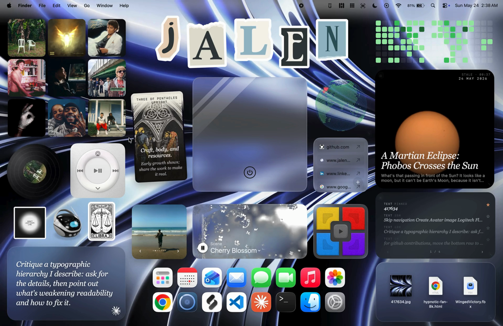

# daily-astronomy-photo

> NASA's Astronomy Picture of the Day, full-bleed, with inline video on .mp4 days.

A self-contained widget for [Übersicht](http://tracesof.net/uebersicht/). The
entire widget lives in `index.jsx` (the shared design system is inlined), so it
runs on any Mac with no extra files beyond the bundled assets.

### On the desktop

The widget shown running alongside the full set:

## Install

1. Install and run [Übersicht](http://tracesof.net/uebersicht/).
2. Unzip `daily-astronomy-photo.widget.zip`, or copy the `daily-astronomy-photo.widget` folder into your
   Übersicht widgets directory:
   `~/Library/Application Support/Übersicht/widgets/`
3. Refresh Übersicht (menu bar icon -> Refresh All).

## Notes

- Image days show the photo; video days play an inline .mp4 or link out via a play badge.
- Click the caption to expand the full description.
- Works with NASA's public DEMO_KEY (rate-limited).
- Optional: install the Instrument Serif and Geist font families for the intended typography; system fonts are used as a fallback.

## How to edit

Set API_KEY in index.jsx to a free key from https://api.nasa.gov for higher rate limits.

All visual styling (colors, fonts, the card shell, drag/resize handles) is in
the inlined design-system block at the top of `index.jsx`.

## Bundled files

- `index.jsx`

## Other widgets

- [Animated Wallpaper](https://github.com/jke48222/animated-wallpaper-widget)
- [Clipboard History](https://github.com/jke48222/clipboard-history-widget)
- [Daily AI Prompt](https://github.com/jke48222/daily-ai-prompt-widget)
- [Daily Tarot](https://github.com/jke48222/daily-tarot-widget)
- [GitHub Contributions](https://github.com/jke48222/github-contributions-widget)
- [Now Playing](https://github.com/jke48222/now-playing-widget)
- [Recent Album Covers](https://github.com/jke48222/recent-album-covers-widget)
- [Recent Downloads](https://github.com/jke48222/recent-downloads-widget)
- [Rotating 3D Model](https://github.com/jke48222/rotating-3d-model-widget)
- [Spinning Globe](https://github.com/jke48222/spinning-globe-widget)
- [Wallpaper Switcher](https://github.com/jke48222/wallpaper-switcher-widget)

## Author

Jalen Edusei <jalen.edusei@gmail.com>
